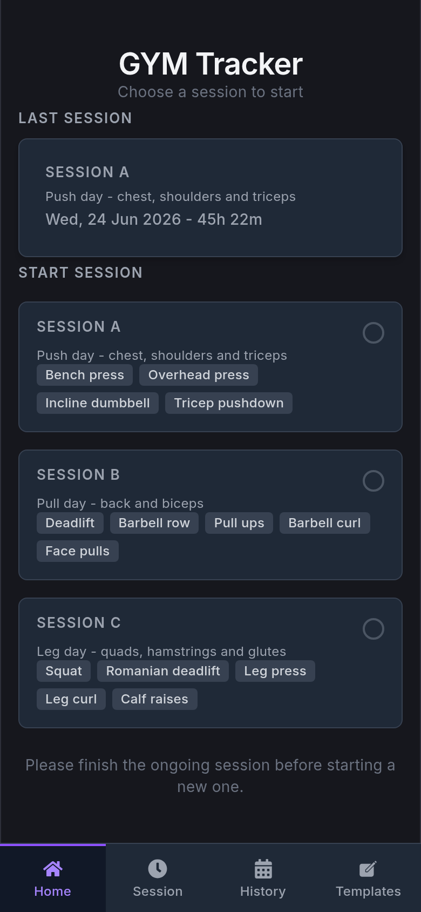
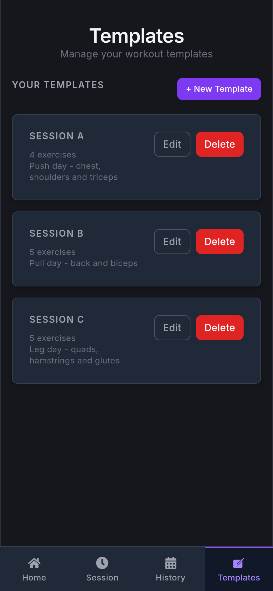
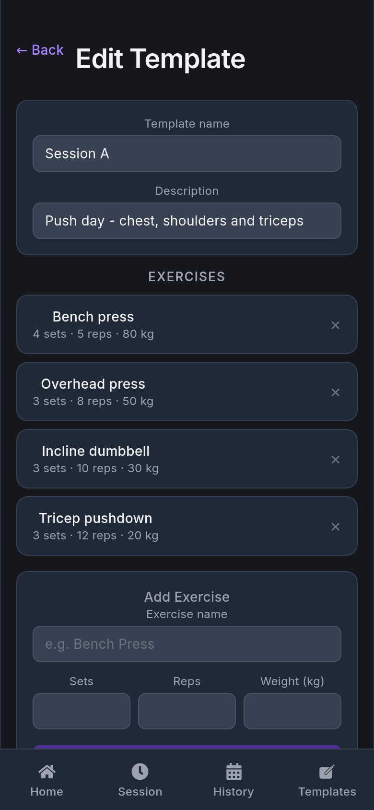
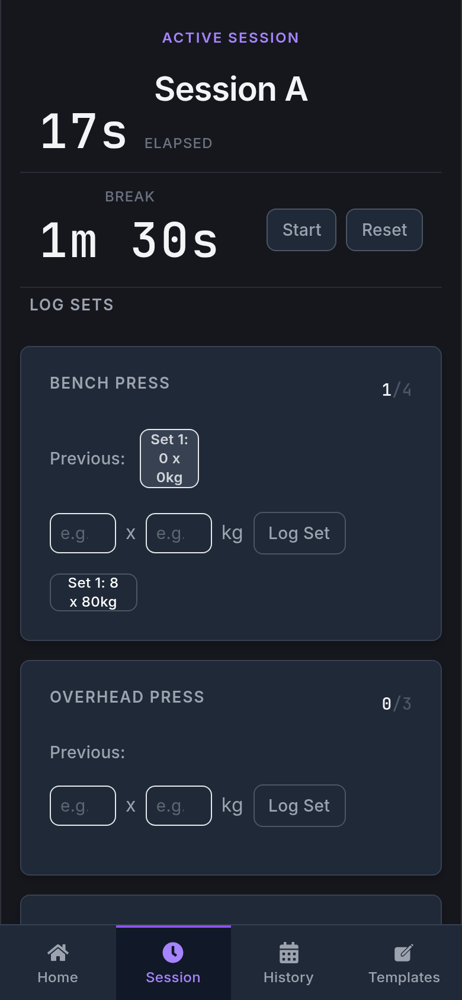
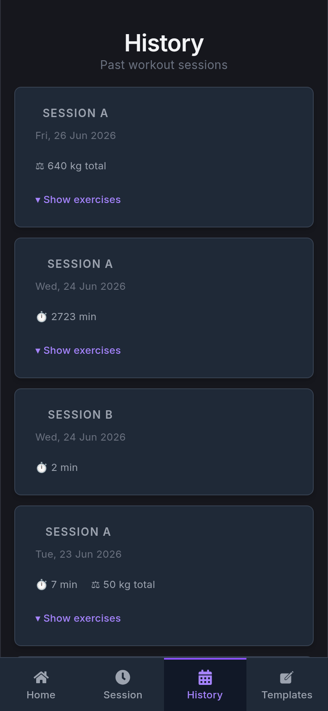

# GymTracker — Frontend

A mobile-first React app for tracking gym workouts in real time. Pick a template, start a session, log your sets with weights and reps, and review your history.

## Screenshots

| Home | Templates | Edit Template |
|:----:|:---------:|:-------------:|
|  |  |  |

| Active Session | History |
|:--------------:|:-------:|
|  |  |

## Features

- **Home dashboard** — shows your last session and lets you pick a template to start a new one
- **Active session tracking** — log sets with reps and weight for each exercise; built-in break timer counts down your rest
- **Template management** — create and edit reusable workout plans with exercises, default sets, reps, and weights
- **Workout history** — paginated list of past sessions with total weight moved and duration
- **Previous session reference** — while logging, see what you lifted last time for each exercise

## Tech Stack

| Layer | Technology |
|-------|-----------|
| UI framework | React 19 + TypeScript |
| Styling | Tailwind CSS v4 + Flowbite React |
| Routing | React Router v7 |
| Server state | TanStack React Query |
| UI state | Zustand |
| Forms | React Hook Form |
| HTTP | Axios (proxied to backend at `/api`) |
| Build | Vite |

## Getting Started

### Prerequisites

- Node.js 20+
- Backend API running on port 8080 — see [gym README](../../gym/README.md)

### Run locally

```bash
npm install
npm run dev
```

App runs at `http://localhost:3000`. All `/api` requests proxy to the backend.

```bash
npm run lint   # ESLint with TypeScript strict mode
```

## Project Structure

```
src/
├── pages/          # Route-level components (HomePage, Session, Templates, History)
├── components/     # Reusable UI pieces (BreakTimer, LogExerciseCard, NavBarMobile …)
├── hooks/          # React Query data-fetching hooks
├── stores/         # Zustand stores for local UI state
└── types/          # Shared TypeScript interfaces
```

## How It Works

Pages fetch data through React Query hooks in `src/hooks/` — no direct API calls in components. Each hook wraps a query or mutation and exposes `data`, `isLoading`, and `error`.

Local UI state (selected template, break timer state) lives in Zustand stores at `src/stores/`.

The backend REST API is documented with Swagger UI at `http://localhost:8080/swagger-ui.html`.
