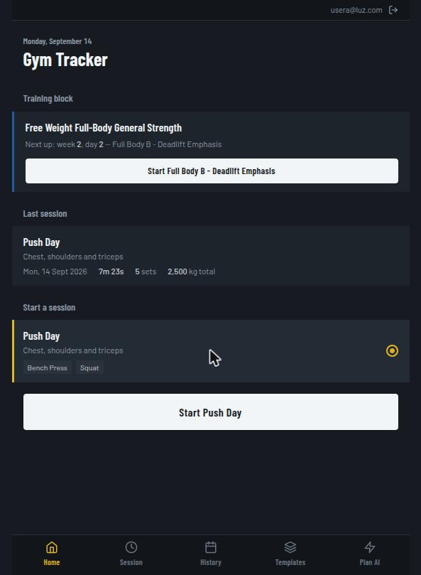
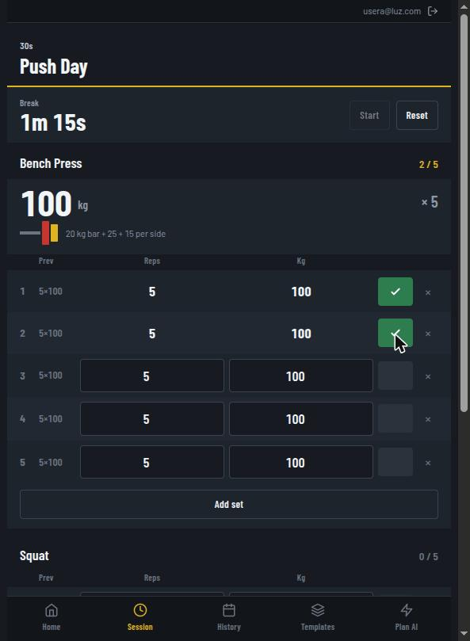
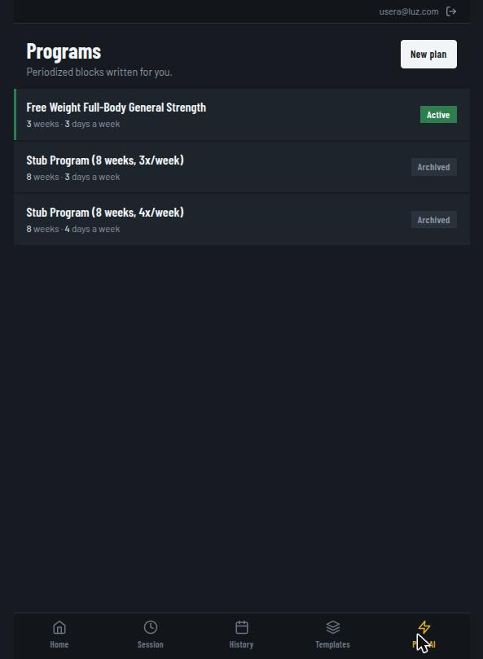
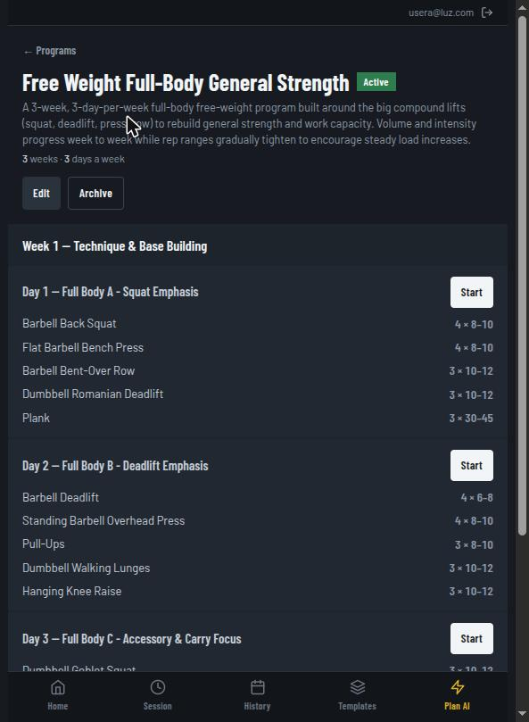
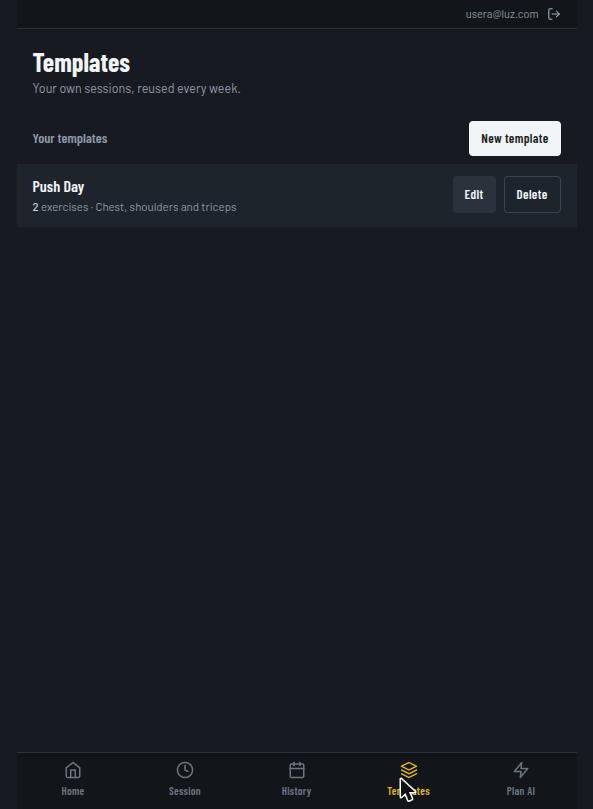
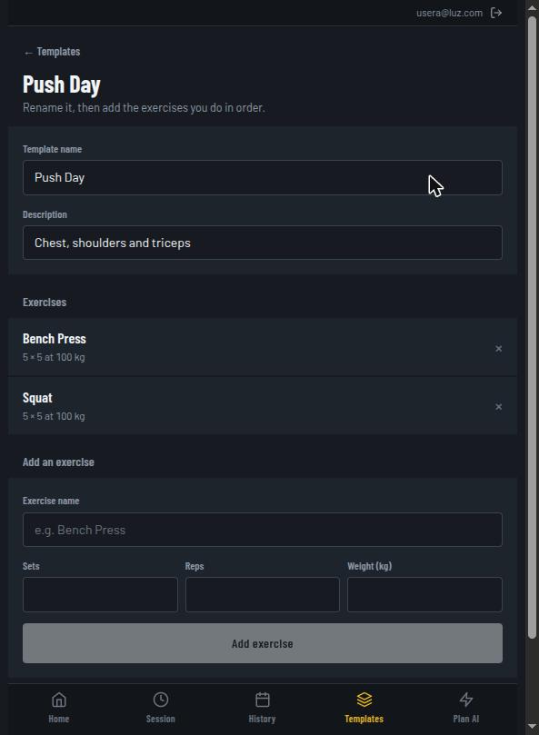
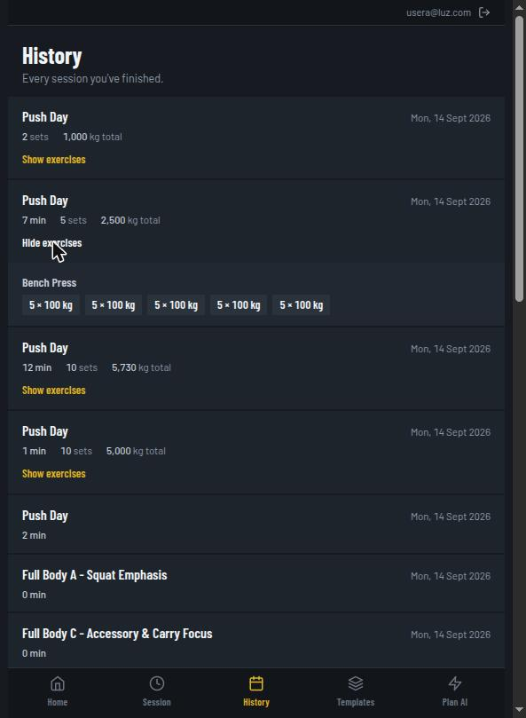

# GymTracker — Frontend

A mobile-first React app for tracking gym workouts in real time. Start a session from your own template or from an AI-written training block, log every set as you do it, and let the rest timer run itself.

**[Live demo →](https://gymtracker-frontend-production.up.railway.app/)**

## Screenshots

| Home | Active session | Programs |
|:----:|:--------------:|:--------:|
|  |  |  |

| Program detail | Templates | Edit template | History |
|:--------------:|:---------:|:-------------:|:-------:|
|  |  |  |  |

## Features

- **Home dashboard** — your active training block with the next day queued up, your last session, and your own templates to pick from
- **Active session tracking** — log reps and weight set by set; a saved set locks in and turns green
- **Barbell plate bar** — the working weight is shown large, with the plates you need on each side underneath (`20 kg bar + 25 + 15 per side`). Weights that can't come from a loaded barbell — dumbbells, machines — show no bar rather than a guess
- **Self-starting rest timer** — ticking a set starts the break automatically, using that exercise's prescribed `restSeconds` from the program, or 90 seconds when the plan doesn't say. It runs off the wall clock, so leaving the session screen doesn't reset it
- **Previous session reference** — every set row shows what you lifted for that set last time, and prefills from it
- **AI training programs** — generate a periodized block from your goal, equipment and training history; review and edit it week by week before saving, then start any day straight from the program
- **Template management** — build reusable sessions with exercises and their default sets, reps and weight
- **Workout history** — past sessions with duration, set count and total weight moved, expandable to every set

## Design

The interface is built around competition plate colours, so colour carries weight instead of decorating: **25 kg red, 20 kg blue, 15 kg yellow, 10 kg green, 5 kg white**. Yellow doubles as the interface accent for whatever is active or selected, red marks destructive actions, green a completed set. Type is Barlow Condensed for figures and headings, Barlow for running text.

The whole palette and both typefaces live as tokens in the `@theme` block of `src/index.css`. Components style through those tokens — `bg-platform-800`, `text-steel`, `font-condensed` — never a hard-coded hex, so the look changes in one file.

## Tech Stack

| Layer | Technology |
|-------|-----------|
| UI framework | React 19 + TypeScript |
| Styling | Tailwind CSS v4, design tokens in `@theme` |
| Routing | React Router v7 |
| Server state | TanStack React Query |
| UI state | Zustand |
| Auth | Keycloak via `react-oidc-context` (Authorization Code + PKCE) |
| Forms | React Hook Form |
| HTTP | Axios (proxied to backend at `/api`) |
| Build | Vite |

## Getting Started

### Prerequisites

- Node.js 20+
- Backend API on port 8080 and Keycloak on port 8081 — both come up with the backend's Docker setup, see the [gym README](../../gym/README.md)

### Configure

Copy `.env.example` to `.env` and point it at your Keycloak realm:

```bash
VITE_KEYCLOAK_URL=http://localhost:8081
VITE_KEYCLOAK_REALM=gymtracker
VITE_KEYCLOAK_CLIENT_ID=gym-api
```

`VITE_API_BASE_URL` stays empty for local development — the Vite proxy sends `/api` to `localhost:8080`.

### Run locally

```bash
npm install
npm run dev
```

App runs at `http://localhost:3000`, which is also the redirect URI registered in Keycloak — starting it on another port will fail the login redirect.

```bash
npm run lint    # ESLint with TypeScript strict mode
npm run build   # type-check and production build
```

## Project Structure

```
src/
├── pages/          # Route-level components (HomePage, Session, Programs, History …)
├── components/     # Reusable UI pieces (BreakTimer, ExerciseSetsTable, PlateLoad …)
│   └── ui/         # Design-system primitives: Button, StatusBadge, form classes
├── hooks/          # React Query data-fetching hooks
├── api/            # Axios calls, one module per backend resource
├── stores/         # Zustand stores for local UI state
├── auth/           # Keycloak / OIDC configuration
├── utils/          # Pure helpers (date formatting, barbell plate maths)
└── types/          # Shared TypeScript interfaces
```

## How It Works

Pages fetch data through React Query hooks in `src/hooks/` — no direct API calls in components. Each hook wraps a query or mutation and exposes `data`, `isLoading`, and `error`.

Local UI state lives in Zustand at `src/stores/`. The ongoing session sits there alongside the rest timer, which is why ticking a set in `ExerciseSetsTable` can start the break in `BreakTimer` without either component knowing about the other — `useLogExerciseSet` starts it when the set is actually saved.

The break is stored as the timestamp it began, not as a countdown, so the remaining time is always derived from the clock rather than from how often a component happened to re-render.

The backend REST API is documented with Swagger UI at `http://localhost:8080/swagger-ui.html`.
